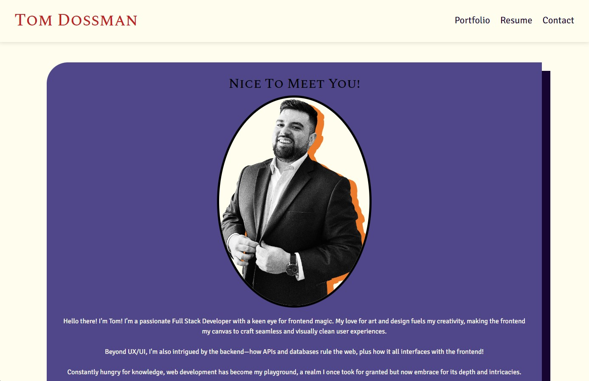
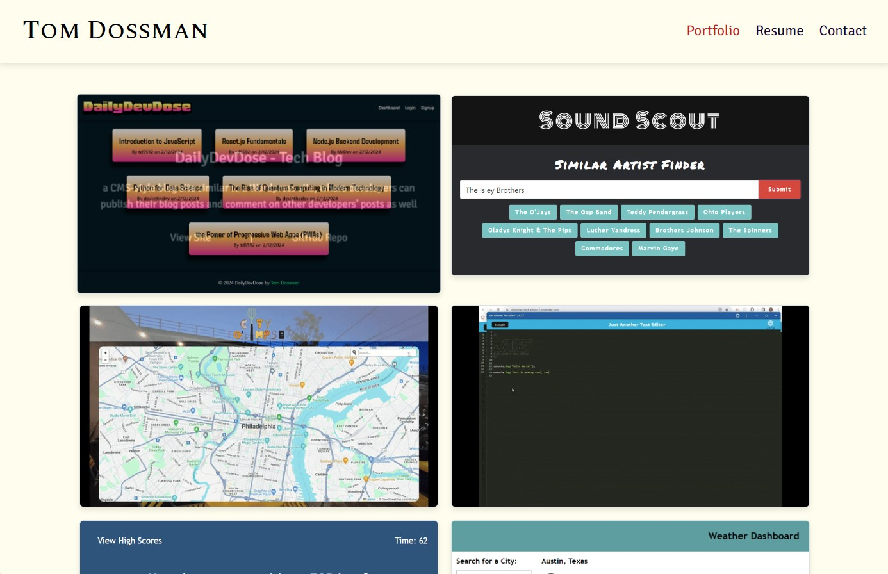
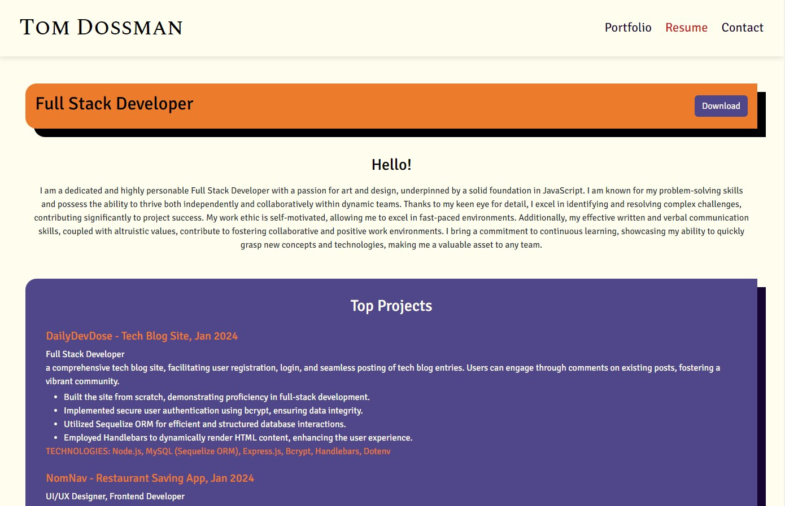
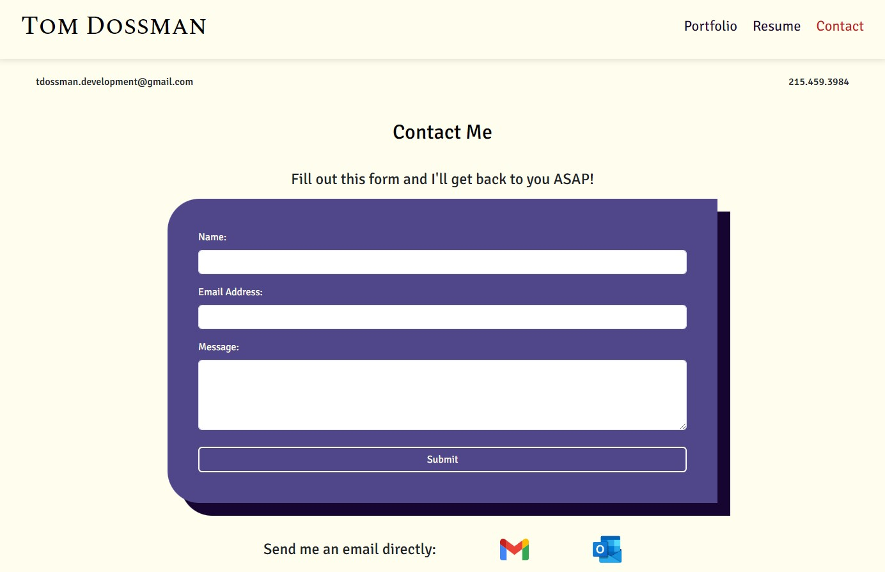

# Tom Dossman's Full Stack Portfolio (Built w/React)

## License

This project is licensed under the [MIT License] - see [LICENSE](LICENSE) file for more details.

## Description

Welcome to my professional portfolio built using React and React Router! This portfolio showcases my skills, projects, and experience in a user-friendly and visually appealing manner. Navigate through the various sections, including an about me, my portfolio, resume, and contact information. 

## Table of Contents

- [License](#license)
- [Description](#description)
- [Screenshots](#screenshots)
- [Usage](#usage)
- [Technologies](#technologies)
- [Questions](#questions)

## Screenshots

### About Me
 

### Portfolio

### Resume

### Contact

## Usage

1) Visit Deployed Site: 
[view my React Portfolio!](https://tomdossman-portfolio.netlify.app/)
2) Click on the navigation links to switch between my about me, portfolio, resume, and contact pages. 
3) To contact me, either fill out the contact form, click on the gmail, or outlook buttons, or phone me using the provided phone number. 
4) Download my resume by clicking the download button in my resume page.  
5) To navigate to my about me page, click on my name in the header.  

## Technologies

### Bootstrap 

## Questions

[Follow me on Github!](https://github.com/Dossman-thomas)

Have any further questions? Feel free to reach me via tdossman.development@gmail.com
